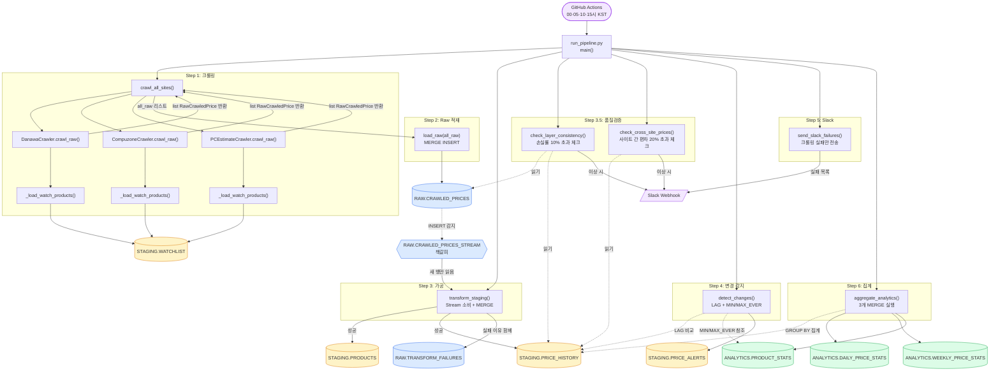
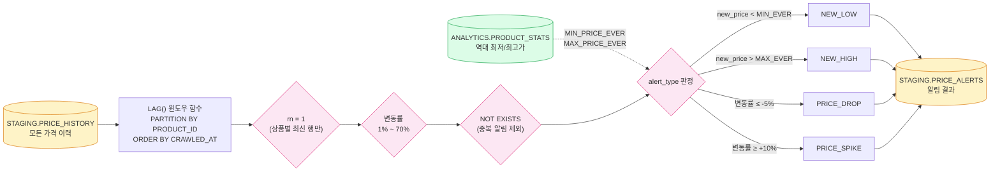
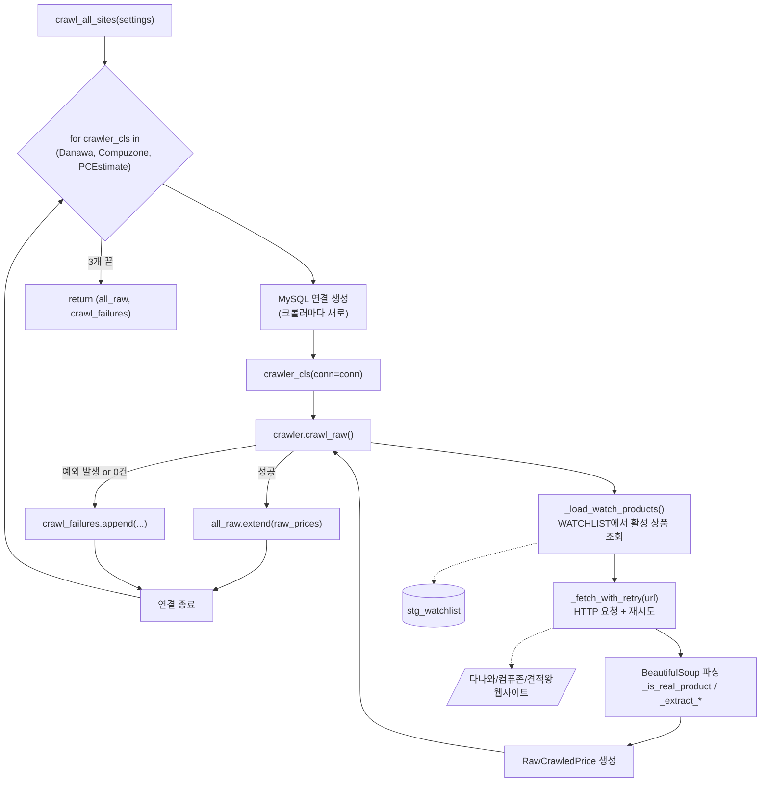

# 파이프라인 함수 흐름도

## 전체 파이프라인 (Step 1 ~ Step 6)

---

## detect_changes() 함수 내부 흐름

---

## crawl_all_sites() 함수 내부 흐름

> 커넥션을 크롤러 하나마다 열고 닫는 이유: 커넥션의 유일한 사용처는 `_load_watch_products()`
> 뿐이라, 하나를 3개 크롤러에 걸쳐 재사용하면 앞선 사이트가 무응답으로 수 분간 붙들려 있는
> 동안 유휴 커넥션이 끊겨 뒤 사이트가 `(2006) MySQL server has gone away`로 죽는다.
> (2026-07-28 장애)

---

## 테이블별 읽기/쓰기 매트릭스

| 함수 | 읽기 | 쓰기 |
|---|---|---|
| `crawl_all_sites()` | `STAGING.WATCHLIST` | — |
| `load_raw()` | — | `RAW.CRAWLED_PRICES` |
| `transform_staging()` | `RAW.CRAWLED_PRICES_STREAM` | `STAGING.PRODUCTS` `STAGING.PRICE_HISTORY` `RAW.TRANSFORM_FAILURES` |
| `check_layer_consistency()` | `RAW.CRAWLED_PRICES` `STAGING.PRICE_HISTORY` `ANALYTICS.PRODUCT_STATS` | (Slack만) |
| `check_cross_site_prices()` | `STAGING.PRICE_HISTORY` `STAGING.PRODUCTS` | (Slack만) |
| `detect_changes()` | `STAGING.PRICE_HISTORY` `ANALYTICS.PRODUCT_STATS` | `STAGING.PRICE_ALERTS` |
| `send_slack_failures()` | (`crawl_failures` 변수) | (Slack만) |
| `aggregate_analytics()` | `STAGING.PRICE_HISTORY` | `ANALYTICS.DAILY_PRICE_STATS` `ANALYTICS.WEEKLY_PRICE_STATS` `ANALYTICS.PRODUCT_STATS` |

---

## 색상 범례

- 🟦 **파랑** — RAW 스키마 (원본 데이터)
- 🟨 **노랑** — STAGING 스키마 (가공 데이터)
- 🟩 **초록** — ANALYTICS 스키마 (집계 데이터)
- 🟪 **보라** — 외부 시스템 (GitHub Actions, Slack, 웹사이트)
