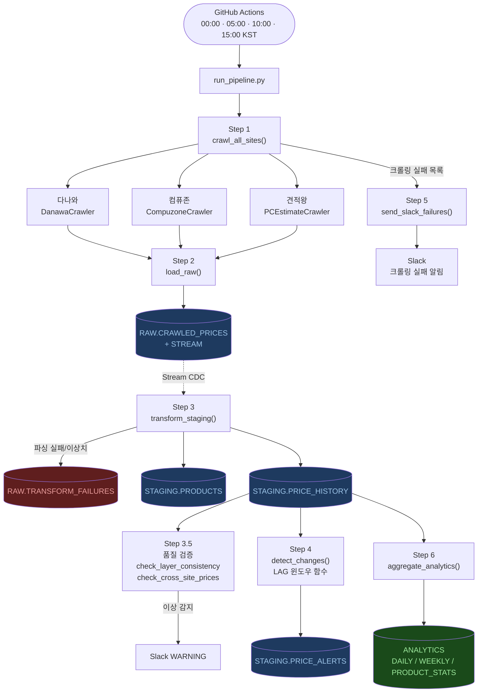
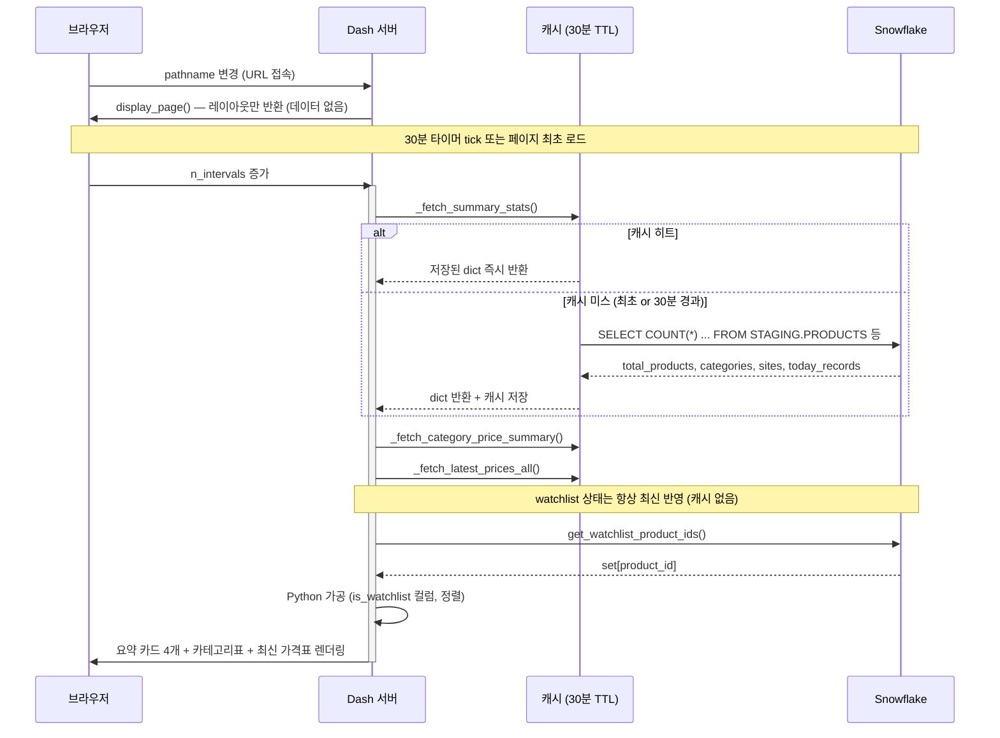
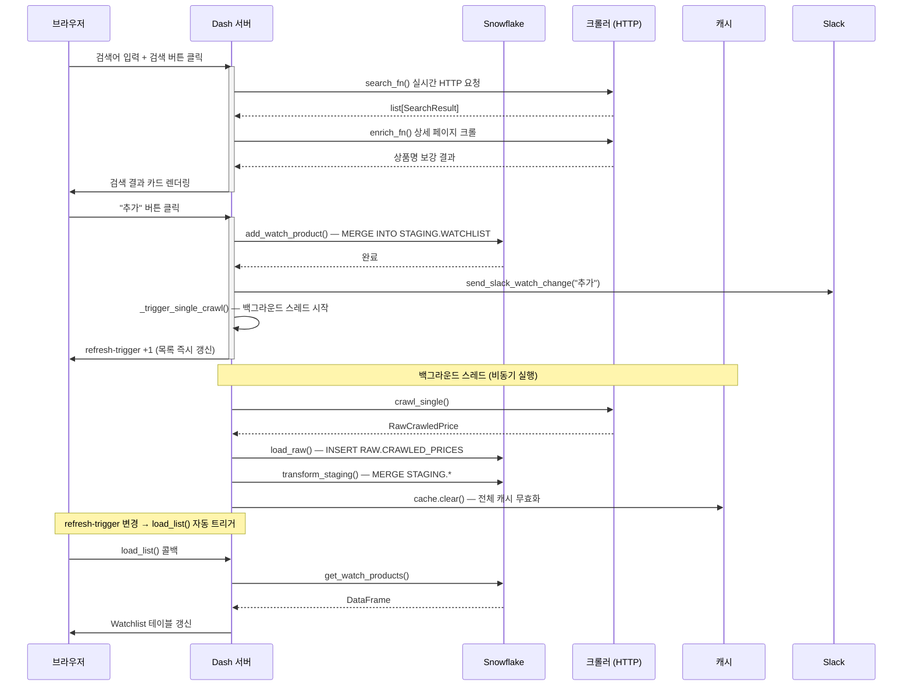

# 컴퓨터 가격 모니터링 시스템 — 전체 워크플로우

작성일: 2026-05-28  
대상 코드: master 브랜치 기준

---

## 목차

1. [시스템 개요](#1-시스템-개요)
2. [파이프라인 워크플로우 (자동 실행)](#2-파이프라인-워크플로우-자동-실행)
   - Step 1: 크롤링
   - Step 2: Raw 적재
   - Step 3: Staging 변환
   - Step 3.5: 데이터 품질 검증
   - Step 4: 변경 감지
   - Step 5: Slack 알림
   - Step 6: Analytics 집계
3. [대시보드 워크플로우 (사용자 상호작용)](#3-대시보드-워크플로우-사용자-상호작용)
   - 페이지 진입 / 라우팅
   - Overview 페이지 자동 갱신
   - 가격표 필터링
   - 가격 추이 검색
   - 알림 조회
   - Watchlist 상품 추가
   - Watchlist 상품 삭제
4. [캐시 레이어](#4-캐시-레이어)
5. [DB 테이블 참조표](#5-db-테이블-참조표)

---

## 1. 시스템 개요

```
[GitHub Actions 스케줄]
  00:00 / 05:00 / 10:00 / 15:00 KST (하루 4회)
        │
        ▼
  run_pipeline.py
  (Step1 → Step2 → Step3 → Step3.5 → Step4 → Step5 → Step6)
        │
        ▼
  Snowflake DWH
  RAW → STAGING → ANALYTICS
        │
        ▼
  [사용자 브라우저]
  localhost:8050 (Dash 대시보드)
  ← Snowflake 쿼리 → Flask-Caching (SimpleCache, TTL 30분)
```

---

## 2. 파이프라인 워크플로우 (자동 실행)

### 파이프라인 플로우차트

> VS Code Mermaid Preview, GitHub, Obsidian 등 Mermaid 렌더러가 있는 환경에서 시각화됩니다.



---

### 진입점

| 항목 | 내용 |
|------|------|
| 트리거 | GitHub Actions 스케줄 (`cron: '0 15,20,1,6 * * *'` UTC → KST 00:00/05:00/10:00/15:00) |
| 파일 | `run_pipeline.py` |
| 함수 | `main()` |
| 반환 | `int` (0 = 성공, 1 = 치명 오류) |

---

### Step 1: 크롤링

**트리거:** `main()` 진입 → `crawl_all_sites(settings)` 호출

```
crawl_all_sites(settings)
  └─ get_connection(settings)          # Snowflake 연결 (WATCHLIST 조회용)
  └─ DanawaCrawler(conn=conn)
       └─ crawler.crawl_raw()
            ├─ STAGING.WATCHLIST 에서 활성 상품(IS_ACTIVE=TRUE, SITE='다나와') 조회
            ├─ 다나와 목록 페이지 HTML 파싱 (BeautifulSoup)
            │    광고 필터링: productItem* 는 실제상품,
            │                adReaderProductItem* / adPointProductItem* 는 제외
            ├─ pcode 로 WATCHLIST 매칭
            └─ [RawCrawledPrice, ...] 반환
  └─ CompuzoneCrawler(conn=conn)
       └─ crawler.crawl_raw()
            ├─ STAGING.WATCHLIST 에서 활성 상품(SITE='컴퓨존') 조회
            ├─ 컴퓨존 목록 페이지 HTML 파싱
            │    미노출 상품 → 상세 페이지 직접 스크래핑 (fallback)
            └─ [RawCrawledPrice, ...] 반환
  └─ PCEstimateCrawler(conn=conn)
       └─ crawler.crawl_raw()
            ├─ STAGING.WATCHLIST 에서 활성 상품(SITE='견적왕') 조회
            ├─ 견적왕 페이지 HTML 파싱
            └─ [RawCrawledPrice, ...] 반환
```

**RawCrawledPrice 구조:**
```
site        : "danawa" / "compuzone" / "kjwwang"  ← 크롤러 내부 코드명
category    : "GPU" / "CPU" / "RAM" / "SSD" / ...
product_name: 상품명 (원문, 미정제)
price_text  : "300,000원" 형태 원문 문자열
brand       : 브랜드명 (있을 경우)
url         : 상품 상세 페이지 URL
crawled_at  : datetime (UTC)
```

**오류 처리:**
- 사이트별 예외(`RequestException`, `ValueError`, `AttributeError` 등) → `crawl_failures` 리스트에 기록
- 수집 0건도 실패로 기록 ("페이지 구조 변경 의심")
- 개별 사이트 실패 시 나머지 사이트는 계속 진행

**출력:** `(all_raw: list[RawCrawledPrice], crawl_failures: list[dict])`

---

### Step 2: Raw 적재

**트리거:** `all_raw` 가 비어있지 않으면 → `load_raw(settings, all_raw)` 호출

```
load_raw(settings, all_raw)
  └─ RAW.CRAWLED_PRICES 에 INSERT (벌크)
       컬럼: SITE, CATEGORY, PRODUCT_NAME, PRICE_TEXT, BRAND, URL, CRAWLED_AT
```

**Snowflake 테이블 변화:**

| 테이블 | 작업 | 설명 |
|--------|------|------|
| `RAW.CRAWLED_PRICES` | INSERT | 원문 그대로 저장 (가격 파싱 전) |
| `RAW.CRAWLED_PRICES_STREAM` | 자동 업데이트 | Snowflake Stream이 새 INSERT를 CDC로 추적 |

**포인트:** 이 단계에서 데이터는 정제되지 않은 원문 상태. `PRICE_TEXT = "300,000원"` 형태 그대로 저장.

---

### Step 3: Staging 변환

**트리거:** `transform_staging(settings)` 호출

```
transform_staging(settings)
  └─ CREATE OR REPLACE TEMPORARY TABLE TEMP_STREAM_DATA AS
       SELECT ... FROM RAW.CRAWLED_PRICES_STREAM
       WHERE METADATA$ACTION = 'INSERT'
         ← DML 실행으로 Stream offset 이동 (소비된 레코드는 다음 실행에서 재조회 안됨)

  └─ Python에서 각 행 처리:
       1. parse_korean_price(price_text)
            "300,000원" → 300000 (int)
            실패 시 → failures에 추가 ("가격 파싱 실패")

       2. validate_price(price, category)
            카테고리별 정상 범위 확인 (예: GPU는 10만~500만원 범위)
            범위 초과 → failures에 추가 ("카테고리 범위 초과")

       3. _SITE_DISPLAY_MAP 매핑
            "danawa"    → "다나와"
            "compuzone" → "컴퓨존"
            "kjwwang"   → "견적왕"

       4. 상품명 정규화
            re.sub(r"\s+", " ", name.strip())

  └─ 실패 레코드 → RAW.TRANSFORM_FAILURES 에 INSERT
       (CRAWLED_PRICES_ID, SITE, CATEGORY, PRODUCT_NAME, PRICE_TEXT, CRAWLED_AT, REJECT_REASON)

  └─ 정상 레코드 처리:
       MERGE INTO STAGING.PRODUCTS
         키: (SITE, PRODUCT_NAME)
         신규: INSERT (SITE, CATEGORY, PRODUCT_NAME, BRAND, URL)
         기존: UPDATE URL (비어있지 않으면), UPDATED_AT

       SELECT PRODUCT_ID FROM STAGING.PRODUCTS  (product_map 구성)

       MERGE INTO STAGING.PRICE_HISTORY
         키: (PRODUCT_ID, CRAWLED_AT)
         신규만: INSERT (PRODUCT_ID, RAW_ID, PRICE, CRAWLED_AT)
         ← CRAWLED_AT 단위 멱등성 보장 (같은 시각 재실행해도 중복 없음)
```

**Snowflake 테이블 변화:**

| 테이블 | 작업 | 설명 |
|--------|------|------|
| `RAW.CRAWLED_PRICES_STREAM` | 소비 (offset 이동) | TEMP TABLE 생성 DML로 소비 |
| `RAW.TRANSFORM_FAILURES` | INSERT | 파싱 실패 / 이상치 감사 기록 |
| `STAGING.PRODUCTS` | MERGE | 상품 마스터 (신규 등록 / URL 갱신) |
| `STAGING.PRICE_HISTORY` | MERGE | 크롤 시점별 가격 이력 |

**포인트:** `STAGING.LATEST_PRICES` 는 `STAGING.PRICE_HISTORY` 위의 **VIEW** (최신 가격 한 건씩). 별도 적재 없음.

---

### Step 3.5: 데이터 품질 검증

**트리거:** `check_layer_consistency(settings)` + `check_cross_site_prices(settings)` 호출  
오류 발생해도 파이프라인은 계속 진행 (try/except로 감쌈)

#### 레이어 정합성 검사

```
check_layer_consistency(settings)
  └─ 쿼리 1: RAW.CRAWLED_PRICES 오늘 건수  vs  STAGING.PRICE_HISTORY 오늘 건수
       ← 오늘 기준: CONVERT_TIMEZONE('UTC', CURRENT_TIMESTAMP())::DATE

  └─ 쿼리 2: PRICE_HISTORY는 있으나 ANALYTICS.PRODUCT_STATS에 없는 상품 수
       (신규 상품 중 analytics 집계 누락 탐지)

  └─ 판정:
       drop_rate > 10%      → Slack WARNING
       missing_analytics > 0 → Slack WARNING
```

#### 교차 검증

```
check_cross_site_prices(settings)
  └─ 쿼리: 오늘 크롤링된 (PRODUCT_NAME, SITE, PRICE) 전체 조회
  └─ Python에서 동일 상품명 여러 사이트 비교
       최저가 대비 20% 이상 비싼 사이트 → 이상치 판정
  └─ 이상치 발견 시 → Slack WARNING 메시지 전송
```

---

### Step 4: 변경 감지

**트리거:** `detect_changes(settings)` 호출

```
detect_changes(settings)
  └─ Snowflake에서 단일 INSERT 쿼리 실행:

     WITH ranked AS (
       STAGING.PRICE_HISTORY에서
       LAG(PRICE) OVER (PARTITION BY PRODUCT_ID ORDER BY CRAWLED_AT) → prev_price
       ROW_NUMBER() DESC → 최신 레코드에 rn=1 부여
     ),
     candidates AS (
       rn=1 (최신) 이면서 prev_price 대비 1%~70% 변동 & 미등록 알림 필터
       LEFT JOIN ANALYTICS.PRODUCT_STATS 로 역대 최저/최고가 참조
     )
     → alert_type 결정:
          new_price < MIN_PRICE_EVER  → 'NEW_LOW'
          new_price > MAX_PRICE_EVER  → 'NEW_HIGH'
          change_pct <= -5.0%         → 'PRICE_DROP'
          change_pct >= +10.0%        → 'PRICE_SPIKE'

  └─ INSERT INTO STAGING.PRICE_ALERTS
       (PRODUCT_ID, DAILY_PRICE_ID, ALERT_TYPE, OLD_PRICE, NEW_PRICE, CHANGE_PCT)
```

**필터 조건:**
- `ABS(change_pct) >= 1.0%` — 노이즈 제거
- `ABS(change_pct) <= 70.0%` — 데이터 이상치 제거
- `NOT EXISTS (이미 해당 DAILY_PRICE_ID로 등록된 알림)` — 중복 방지

**Snowflake 테이블 변화:**

| 테이블 | 작업 | 설명 |
|--------|------|------|
| `STAGING.PRICE_HISTORY` | READ | LAG() 윈도우 함수로 이전 가격 참조 |
| `ANALYTICS.PRODUCT_STATS` | READ | 역대 최저/최고가 참조 |
| `STAGING.PRICE_ALERTS` | INSERT | 새 알림 기록 |

---

### Step 5: Slack 알림 (크롤링 실패)

**트리거:** `send_slack_failures(crawl_failures)` 호출

```
send_slack_failures(crawl_failures)
  └─ crawl_failures 가 비어있으면 건너뜀
  └─ 실패 목록 → Slack Webhook POST (SLACK_WEBHOOK_URL 환경변수)
```

**포인트:** 크롤링 실패 알림만 여기서 전송.  
가격 변동(PRICE_ALERTS)을 Slack으로 보내는 기능은 현재 미구현 — 대시보드에서만 조회 가능.

---

### Step 6: Analytics 집계

**트리거:** `aggregate_analytics(settings)` 호출

```
aggregate_analytics(settings)
  └─ MERGE INTO ANALYTICS.DAILY_PRICE_STATS
       FROM STAGING.PRICE_HISTORY GROUP BY (PRODUCT_ID, CRAWLED_AT::DATE)
       → 일별 최저/최고/평균가, 건수

  └─ MERGE INTO ANALYTICS.WEEKLY_PRICE_STATS
       FROM STAGING.PRICE_HISTORY GROUP BY (PRODUCT_ID, DATE_TRUNC('WEEK', CRAWLED_AT))
       → 주별 최저/최고/평균가, 건수

  └─ MERGE INTO ANALYTICS.PRODUCT_STATS
       FROM STAGING.PRICE_HISTORY GROUP BY PRODUCT_ID
       → 전체 기간 평균/역대최저/역대최고, 최초/최근 크롤일, 총 건수
```

---

### 파이프라인 전체 흐름 요약

```
GitHub Actions
    │
    ▼
[Step 1] crawl_all_sites()
    │  크롤러 3개 순서대로 실행
    │  → list[RawCrawledPrice], list[crawl_failures]
    ▼
[Step 2] load_raw()
    │  INSERT → RAW.CRAWLED_PRICES
    │  Stream이 자동으로 변경 추적
    ▼
[Step 3] transform_staging()
    │  Stream 소비 → 가격 파싱 → 이상치 제거 → 사이트명 변환
    │  MERGE → STAGING.PRODUCTS
    │  MERGE → STAGING.PRICE_HISTORY
    │  실패 → RAW.TRANSFORM_FAILURES
    ▼
[Step 3.5] check_layer_consistency() + check_cross_site_prices()
    │  Raw vs Staging 건수 비교
    │  동일 상품 사이트 간 가격 비교
    │  이상 시 → Slack WARNING
    ▼
[Step 4] detect_changes()
    │  LAG() 윈도우 함수로 직전 가격 비교
    │  INSERT → STAGING.PRICE_ALERTS
    │  (NEW_LOW / NEW_HIGH / PRICE_DROP / PRICE_SPIKE)
    ▼
[Step 5] send_slack_failures()
    │  크롤링 실패 사이트 → Slack 알림
    ▼
[Step 6] aggregate_analytics()
    └  MERGE → ANALYTICS.DAILY/WEEKLY_PRICE_STATS, PRODUCT_STATS
```

---

## 3. 대시보드 워크플로우 (사용자 상호작용)

### 대시보드 구조

```
app.py (Dash 앱 초기화, Docker 컨테이너에서 실행)
  └─ register_callbacks(app, cache)   ← callbacks.py
       ├─ 캐시 래퍼 등록 (_fetch_*)
       ├─ 페이지 라우팅 콜백
       ├─ 각 페이지 콜백
       └─ Watchlist 콜백 (_register_site_watchlist 팩토리로 3개 사이트 등록)
```

**캐시:** Flask-Caching SimpleCache, TTL 1800초(30분). 동일 함수 + 동일 인자 호출 시 캐시 히트.

---

### 페이지 진입 / 라우팅

**트리거:** 브라우저 URL 변경 (`dcc.Location` 컴포넌트가 pathname 변경 감지)

```
사용자 브라우저: URL 변경 (예: /prices)
    │
    ▼
콜백: display_page(pathname)
    Input:  "url" 컴포넌트의 pathname 변경
    Output: "page-content" 컴포넌트의 children
    │
    ├─ "/prices"    → prices_page()    (전체 가격표)
    ├─ "/trends"    → trends_page()    (가격 추이)
    ├─ "/alerts"    → alerts_layout()  (가격 알림)
    ├─ "/watchlist" → watchlist_page() (관심목록)
    └─ "/"          → overview_page()  (메인)
```

**포인트:** 이 콜백은 Snowflake 조회 없음. 단순히 레이아웃 컴포넌트를 반환.  
실제 데이터는 각 페이지의 별도 콜백이 트리거될 때 조회.

---

### Overview 페이지 자동 갱신



**트리거:** `dcc.Interval` 타이머 (30분마다, `refresh-interval`)

```
타이머 30분 경과 (또는 Overview 페이지 최초 로드)
    │
    ▼
콜백: update_overview(_)
    Input:  "refresh-interval"의 n_intervals
    Output: "summary-cards", "category-summary-table", "latest-prices-table"
    │
    ├─ _fetch_summary_stats()
    │    캐시 히트 시: 저장된 dict 반환 (Snowflake 연결 없음)
    │    캐시 미스 시: get_summary_stats(conn)
    │                  SELECT COUNT(*) FROM STAGING.PRODUCTS  → total_products
    │                  SELECT COUNT(DISTINCT CATEGORY) ...    → total_categories
    │                  SELECT COUNT(DISTINCT SITE) ...        → total_sites
    │                  SELECT COUNT(*) WHERE CRAWLED_AT::DATE = 오늘  → today_records
    │
    ├─ _fetch_category_price_summary()
    │    캐시 히트 시: 저장된 DataFrame 반환
    │    캐시 미스 시: get_category_price_summary(conn)
    │                  SELECT CATEGORY, COUNT(*), MIN/MAX/AVG(PRICE)
    │                  FROM STAGING.LATEST_PRICES JOIN STAGING.PRODUCTS
    │                  GROUP BY CATEGORY
    │
    ├─ _fetch_latest_prices_all()
    │    캐시 히트 시: 저장된 DataFrame 반환
    │    캐시 미스 시: get_latest_prices_all(conn)
    │                  SELECT PRODUCT_ID, SITE, CATEGORY, PRODUCT_NAME, BRAND, PRICE, CRAWLED_AT, URL
    │                  FROM STAGING.LATEST_PRICES JOIN STAGING.PRODUCTS
    │                  WHERE WATCHLIST_EXISTS (활성 Watchlist 상품만)
    │
    ├─ get_watchlist_product_ids(conn)  ← 캐시 없음, 매번 직접 조회
    │    SELECT DISTINCT p.PRODUCT_ID WHERE w.IS_ACTIVE = TRUE
    │    URL의 pcode/ProductNo/pd_no 패턴 매칭
    │
    └─ Python 가공:
         prices_df["is_watchlist"] = product_id.isin(watch_ids)
         정렬: is_watchlist DESC, category ASC, price ASC
         (관심 상품이 상단에 표시)
         make_price_table(prices_df, max_rows=20)  → HTML 테이블
    │
    ▼
화면에 렌더링:
    - 요약 카드 4개 (추적상품수, 카테고리수, 사이트수, 오늘수집건)
    - 카테고리별 최저/최고/평균가 표
    - 최신 가격 테이블 (관심상품 상단, 최대 20행)
```

---

### 가격표 필터링 (Prices 페이지)

**트리거:** 카테고리/사이트 버튼 클릭

```
사용자: 카테고리 버튼 (예: "GPU") 또는 사이트 버튼 (예: "다나와") 클릭
    │
    ▼
콜백: _toggle()  ← _register_button_toggle 팩토리가 등록
    Input:  "price-cat-btn-GPU" 등의 n_clicks
    Output: "price-category-filter" 스토어 data = "GPU"
            각 버튼의 outline 스타일 업데이트
    │
    ▼ (price-category-filter 변경이 update_prices_table 콜백을 트리거)

콜백: update_prices_table(category, site)
    Input:  "price-category-filter" data, "price-site-filter" data
    Output: "full-prices-table" children
    │
    ├─ _fetch_latest_prices_all()   ← 캐시 (30분 TTL)
    │    STAGING.LATEST_PRICES JOIN STAGING.PRODUCTS WHERE WATCHLIST_EXISTS
    │
    ├─ get_watchlist_product_ids(conn)  ← 직접 조회
    │
    └─ Python 필터링:
         if category != "ALL": df = df[df["category"] == category]
         if site != "ALL":     df = df[df["site"] == site]
         정렬: is_watchlist DESC, category ASC, price ASC
         make_price_table(df)  → HTML 테이블 (행 수 제한 없음)
```

---

### 가격 추이 검색 (Trends 페이지)

**트리거:** 검색어 입력 + 기간/카테고리 버튼

```
사용자: 검색창에 "RTX 4090" 입력 후 Enter
    │
    ▼
콜백: update_trend_chart(category, search, days)
    Input:  "trend-category-filter", "trend-search-input" value, "trend-period"
    Output: "trend-chart" figure, "trend-summary" children
    │
    ├─ _fetch_price_trend(category="ALL", search="RTX 4090", days=None)
    │    캐시 미스: get_price_trend(conn, search="RTX 4090")
    │    SELECT p.SITE, dp.CRAWLED_AT, MIN(dp.PRICE)
    │    FROM STAGING.PRICE_HISTORY dp JOIN STAGING.PRODUCTS p
    │    WHERE p.PRODUCT_NAME ILIKE '%RTX 4090%'
    │    GROUP BY p.SITE, dp.CRAWLED_AT
    │    ORDER BY dp.CRAWLED_AT
    │
    └─ Python 가공:
         px.line() 으로 사이트별 컬러 라인 차트 생성
           색상: SITE_COLORS 딕셔너리 (다나와=파랑, 컴퓨존=초록, 견적왕=빨강)
         요약 카드: 최저가/최고가 (사이트명 포함), 가격차, 데이터포인트수

[연동] 오늘 크롤링 비교 테이블

콜백: update_today_comparison(category)
    Input:  "trend-category-filter"
    Output: "today-comparison-datatable" data, columns
    │
    ├─ _fetch_today_crawl_comparison(category=category)
    │    get_today_crawl_comparison(conn)
    │    오늘 크롤링 1~4차 가격을 PIVOT
    │    (ROW_NUMBER() OVER PARTITION BY PRODUCT_ID ORDER BY CRAWLED_AT)
    │
    └─ Python 가공:
         _change(): 이전 차 대비 up/down 표시
         { site, category, product_name, "1차": "300,000원", "2차": "295,000원", ... }

[연동] 테이블 셀 클릭 → 검색어 자동 입력

콜백: click_today_table_cell(active_cell, data)
    Input:  "today-comparison-datatable" active_cell
    State:  "today-comparison-datatable" data
    Output: "trend-search-input" value ← 상품명 자동 입력
    └─ active_cell의 column_id == "product_name" 일 때만 동작
```

---

### 알림 조회 (Alerts 페이지)

**트리거:** 페이지 진입 / 필터 버튼 클릭 / 5분 자동 갱신 타이머

```
알림 유형 버튼 클릭 (예: "NEW_LOW")
    │
    ▼
콜백: _toggle() → "alert-type-filter" 스토어 = "NEW_LOW"
    │
    ▼
콜백: update_alerts_table(alert_type, category, _)
    Input:  "alert-type-filter", "alert-category-filter", "alerts-refresh-interval"
    Output: "alerts-table" children
    │
    ├─ _fetch_alerts(alert_type="NEW_LOW", category=None)
    │    get_alerts(conn, alert_type="NEW_LOW")
    │    SELECT a.*, p.SITE, p.CATEGORY, p.PRODUCT_NAME, p.URL
    │    FROM STAGING.PRICE_ALERTS a JOIN STAGING.PRODUCTS p
    │    WHERE ABS(CHANGE_PCT) >= 1.0   ← 1% 미만 노이즈 제거
    │      AND a.ALERT_TYPE = "NEW_LOW"
    │    ORDER BY CREATED_AT DESC
    │
    └─ Python 가공:
         날짜별 그룹 헤더 ("오늘", "어제", "2026-05-27")
         알림 유형별 색상 (NEW_LOW=초록, NEW_HIGH=빨강, PRICE_DROP=파랑, PRICE_SPIKE=주황)
         상품명 → 클릭 가능한 링크 (href=URL)
         "old_price원 → new_price원 (+X.X%)" 형태 출력
```

---

### Watchlist 상품 추가



**트리거:** 검색 버튼 클릭 → 검색 결과에서 "추가" 버튼 클릭

```
[1단계] 검색

사용자: 검색창 "RTX 4090" 입력 후 검색 버튼 클릭 (또는 Enter)
    │
    ▼
콜백: do_search(_btn, _enter, category, query)
      ← _register_site_watchlist(app, cfg) 팩토리 내부 클로저
    Input:  "{prefix}-search-btn" n_clicks, "{prefix}-search-input" n_submit
    State:  "{prefix}-category-select" value, "{prefix}-search-input" value
    Output: "{prefix}-search-store" data, "{prefix}-search-results" children
    │
    ├─ cfg.search_fn(query, category, max_results=10)
    │    다나와:  danawa_search("RTX 4090", max_results=10, category="GPU")
    │    견적왕:  pcest_search("RTX 4090", category="GPU", max_results=10)
    │    컴퓨존:  compuzone_search("RTX 4090", category="GPU", max_results=10)
    │    ← 각 사이트 실시간 HTTP 요청 (Snowflake 조회 없음)
    │
    ├─ cfg.enrich_fn(results, category)
    │    다나와:  danawa_enrich() — 상세 페이지 크롤링으로 정확한 상품명 보강
    │    견적왕:  noop (변환 없음)
    │    컴퓨존:  RAM/SSD 이면 compuzone_enrich(), 그 외 noop
    │
    └─ 반환:
         search-store: [{pcode/pd_no/product_no: "...", product_name: "...", url: "..."}, ...]
         search-results: 카드 UI (상품명, pcode, "추가" 버튼)


[2단계] 추가

사용자: 검색 결과 카드에서 "추가" 버튼 클릭
    │
    ▼
콜백: handle_add(add_clicks, search_results, category, current_trigger)
    Input:  {"type": "watch-add-btn", "index": ALL} n_clicks
    State:  "{prefix}-search-store" data, "{prefix}-category-select" value
    Output: "{prefix}-refresh-trigger" data (트리거 값 +1)
    │
    ├─ 클릭된 버튼 인덱스 파싱 (ctx.triggered[0]["prop_id"])
    ├─ search_results[btn_idx]  — 해당 상품 정보 추출
    │
    ├─ add_watch_product(conn, query, pcode, product_name, category, brand, site)
    │    MERGE INTO STAGING.WATCHLIST
    │    키: (SITE, PCODE)
    │    신규: INSERT
    │    기존: IS_ACTIVE=TRUE 로 복원, QUERY/PRODUCT_NAME/CATEGORY/BRAND 업데이트
    │
    ├─ send_slack_watch_change("추가", product, df_after, site)
    │    Slack에 "Watchlist 추가" 알림 전송
    │
    └─ _trigger_single_crawl(cache, site, product_name, pcode, category, brand)
         threading.Thread(target=_run, daemon=True).start()
         │
         └─ [백그라운드 스레드]
              crawl_and_load_single(settings, site, query, pcode, category, brand)
                └─ _SINGLE_CRAWL_FN[site](query, pcode, category, brand)
                     단일 상품 크롤링 → RawCrawledPrice 한 건
                └─ load_raw(settings, [raw])
                     INSERT → RAW.CRAWLED_PRICES
                └─ transform_staging(settings)
                     Stream 소비 → STAGING에 즉시 반영
              성공 시: cache.clear()  ← 전체 캐시 무효화


[3단계] 목록 자동 갱신

{prefix}-refresh-trigger 값 변경 감지
    │
    ▼
콜백: load_list(_, category)
    Input:  "{prefix}-refresh-trigger" data, "{prefix}-category-select" value
    Output: "{prefix}-list-table" children
    │
    ├─ get_watch_products(conn, site=cfg.site_name)
    │    SELECT w.*, lp.PRICE, lp.CRAWLED_AT
    │    FROM STAGING.WATCHLIST w
    │    LEFT JOIN STAGING.PRODUCTS p (URL 패턴 매칭)
    │    LEFT JOIN STAGING.LATEST_PRICES lp
    │    WHERE 1=1 [AND SITE = ?]
    │    QUALIFY ROW_NUMBER() OVER (...) = 1  ← 중복 제거
    │    ORDER BY IS_ACTIVE DESC, ADDED_AT DESC
    │
    └─ make_watchlist_table(df, del_btn_type)  → HTML 테이블
         (활성/비활성 표시, 삭제 버튼 포함)
```

---

### Watchlist 상품 삭제

**트리거:** Watchlist 테이블에서 삭제 버튼 클릭 → 확인 모달 → 확인 버튼

```
[1단계] 삭제 버튼 클릭 → 확인 모달 열기

사용자: 테이블 행의 삭제 버튼 클릭
    │
    ▼
콜백: open_del_modal(danawa_clicks, pcest_clicks, compuzone_clicks)
    Input:  {"type": "watch-del-btn", "index": ALL},
            {"type": "pcest-del-btn", "index": ALL},
            {"type": "compuzone-del-btn", "index": ALL}
            ← 3개 사이트 삭제 버튼 모두 감청 (하나의 콜백에서 처리)
    Output: "watch-del-confirm-modal" is_open=True
            "watch-pending-del-id" data = watch_id (삭제 대상 ID)
    │
    └─ ctx.triggered[0]["prop_id"]에서 watch_id 파싱
         {"type":"watch-del-btn","index":42} → watch_id=42


[2단계] 확인/취소 버튼

사용자: 모달에서 "확인" 또는 "취소" 클릭
    │
    ▼
콜백: handle_del_confirm(confirm_clicks, cancel_clicks, watch_id, ...)
    Input:  "watch-del-confirm-btn", "watch-del-cancel-btn"
    State:  "watch-pending-del-id" data, 3개 사이트 refresh-trigger
    Output: 모달 닫기, 3개 사이트 refresh-trigger 모두 +1
    │
    ├─ 취소 시: 모달 닫기만 (no_update)
    │
    └─ 확인 시:
         get_watch_products(conn)  ← 삭제 전 스냅샷
         remove_watch_product(conn, watch_id)
           UPDATE STAGING.WATCHLIST SET IS_ACTIVE=FALSE WHERE ID=watch_id
         get_watch_products(conn)  ← 삭제 후 스냅샷
         send_slack_watch_change("삭제", product_info, df_after, site)


[3단계] 3개 사이트 목록 자동 갱신

watch-refresh-trigger, pcest-refresh-trigger, compuzone-refresh-trigger 모두 +1
    │
    ▼
load_list() × 3 (3개 사이트 각각 동시에 트리거)
    └─ get_watch_products(conn, site=...) → make_watchlist_table()
```

---

## 4. 캐시 레이어

| 함수 | 캐시 키 | TTL | 무효화 조건 |
|------|---------|-----|------------|
| `_fetch_summary_stats()` | 함수명 | 30분 | `cache.clear()` (watchlist 추가 직후 크롤 성공 시) |
| `_fetch_category_price_summary()` | 함수명 | 30분 | 동일 |
| `_fetch_latest_prices_all()` | 함수명 | 30분 | 동일 |
| `_fetch_product_stats()` | 함수명 | 30분 | 동일 |
| `_fetch_alerts(alert_type, category)` | 함수명+인자 | 30분 | 동일 |
| `_fetch_today_crawl_comparison(category)` | 함수명+인자 | 30분 | 동일 |
| `_fetch_price_trend(category, search, days)` | 함수명+인자 | 30분 | 동일 |

**캐시 우회 대상 (캐시 없음):**
- `get_watchlist_product_ids()` — Watchlist 변경 즉시 반영 필요
- `get_watch_products()` — Watchlist CRUD 즉시 반영 필요
- `add_watch_product()` / `remove_watch_product()` — 쓰기 작업

**캐시 워밍 (앱 시작 시):**
`register_callbacks()` 가 반환한 `fetchers` 딕셔너리를 `app.py` 에서 호출해 기본 인자로 미리 Snowflake 조회.  
`_fetch_price_trend` 는 search 키워드 없이 의미없으므로 워밍 대상에서 제외.

---

## 5. DB 테이블 참조표

### RAW 레이어

| 테이블 | 쓰기 주체 | 읽기 주체 | 설명 |
|--------|----------|----------|------|
| `RAW.CRAWLED_PRICES` | `load_raw()` | `transform_staging()` | 크롤링 원문 데이터 |
| `RAW.CRAWLED_PRICES_STREAM` | Snowflake 자동 | `transform_staging()` | CDC Stream (DML 실행 시 소비) |
| `RAW.TRANSFORM_FAILURES` | `transform_staging()` | (감사 용도) | 변환 실패 레코드 |

### STAGING 레이어

| 테이블/뷰 | 쓰기 주체 | 읽기 주체 | 설명 |
|-----------|----------|----------|------|
| `STAGING.PRODUCTS` | `transform_staging()` | 대부분의 쿼리 | 상품 마스터 |
| `STAGING.PRICE_HISTORY` | `transform_staging()` | `detect_changes()`, `aggregate_analytics()`, `get_price_trend()` 등 | 크롤 시점별 가격 이력 |
| `STAGING.LATEST_PRICES` | VIEW (자동) | `get_latest_prices_all()`, `get_product_stats()` 등 | PRICE_HISTORY의 최신 가격 (VIEW) |
| `STAGING.WATCHLIST` | `add_watch_product()`, `remove_watch_product()` | 크롤러, `get_watch_products()`, `_WATCHLIST_EXISTS` | 관심상품 목록 |
| `STAGING.PRICE_ALERTS` | `detect_changes()` | `get_alerts()` | 가격 변동 알림 |

### ANALYTICS 레이어

| 테이블 | 쓰기 주체 | 읽기 주체 | 설명 |
|--------|----------|----------|------|
| `ANALYTICS.DAILY_PRICE_STATS` | `aggregate_analytics()` | (미래 확장용) | 일별 가격 통계 |
| `ANALYTICS.WEEKLY_PRICE_STATS` | `aggregate_analytics()` | (미래 확장용) | 주별 가격 통계 |
| `ANALYTICS.PRODUCT_STATS` | `aggregate_analytics()` | `get_product_stats()`, `detect_changes()` | 상품별 역대 최저/최고/평균가 |
